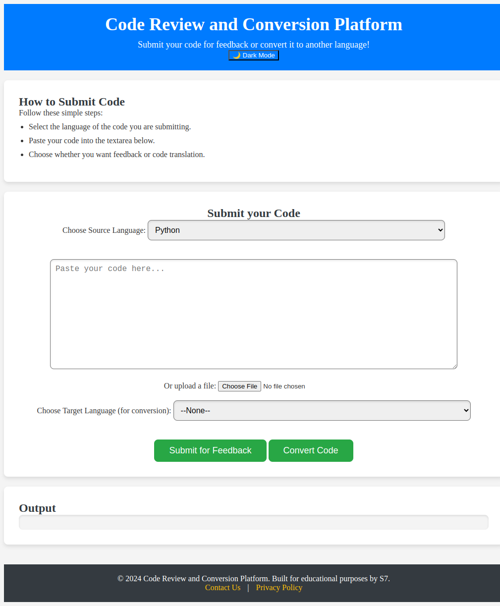
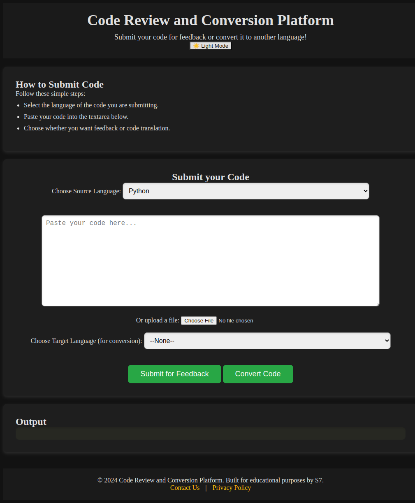
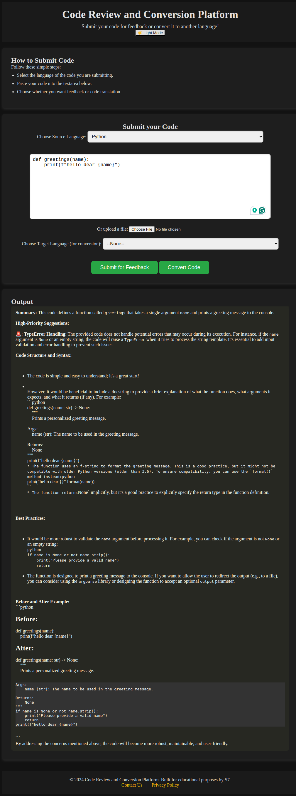
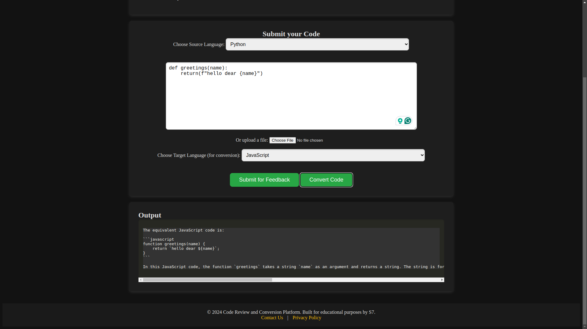

# Sample Python/Flask Application  

A real-time code review and translation platform that provides actionable insights, translations, and analytics for developers.

---

## 🚀 Getting Started  

### Open Using Daytona  

1. **Install Daytona**: Follow the [Daytona installation guide](https://www.daytona.io/docs/installation/installation/).  
2. **Create the Workspace**:  
   ```bash  
   daytona create https://github.com/daytonaio/sample-python-ai-code-review
   ```  

3. **Set Environment Variables**: Add the API key for **Groq**.  
   Create a `.env` file with the following format:
   ```bash
   GROQ_API_KEY=your_groq_api_key
   ```

4. **Run the app**: By following command:
   ```bash
   python3 app.py
   ```

---

## 🔧 Features
- **Instant Code Feedback:** Get actionable suggestions and improvements for your code based on best practices.
- **Code Translation:** Convert code from one programming language to another effortlessly.
- **User-Friendly Interface:** Easy-to-navigate design to enhance user experience.
- **Dark Mode:** Switch between light and dark themes for comfortable viewing.

## 📦 Technologies Used
- **Groq** for both code reviews and code translation
- **Flask** for the backend server
- **HTML/CSS** and **JavaScript** for the frontend
---
<details>
<summary>📸 Screenshots</summary>

### Light/Dark Mode Preview

<table>
  <tr>
    <td></td>
    <td></td>
  </tr>
  <tr>
    <td align="center">Light Mode</td>
    <td align="center">Dark Mode</td>
  </tr>
</table>

### Example screenshots for feedback of code


### Example screenshots for translating the code to different languages


</details>

---

## 🛠️ How Daytona Enhances Development  

**Daytona** is a modern development tool designed to simplify and enhance the process of containerized application development. For this project, Daytona provides:  

- **Automated Environment Setup**: Quickly create and configure isolated development environments tailored for Python/Flask projects.  
- **Dependency Management**: Ensures all project dependencies, such as Flask and the required AI APIs, are installed and correctly configured.  
- **Streamlined Collaboration**: Facilitates real-time collaboration, allowing developers to share and work together on the same environment seamlessly.  
- **Efficient Debugging and Deployment**: Offers tools to debug and test applications in a production-like setup before deployment.  

Daytona's integration makes the development process for this code review platform fast, reliable, and hassle-free.  


## 📚 Additional Resources  

- **Daytona Documentation**: [https://www.daytona.io/docs](https://www.daytona.io/docs)  
- **Python Flask Framework**: [https://flask.palletsprojects.com/](https://flask.palletsprojects.com/)  
- **Groq API**: [https://groq.com/api](https://groq.com/api)  

